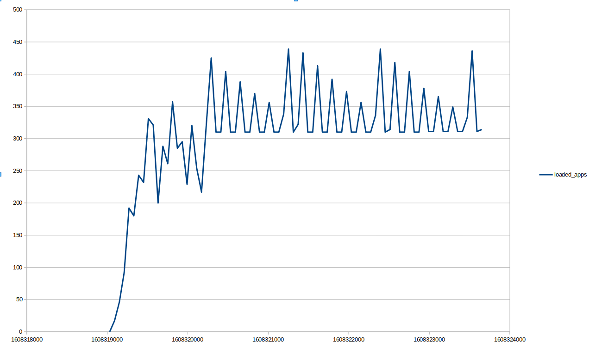

# SHS monitor

A tool to reproduce [SPARK-33841](https://issues.apache.org/jira/browse/SPARK-33841): Jobs disappear intermittently from the SHS under high load.

The issue is caused by [SPARK-29043](https://issues.apache.org/jira/browse/SPARK-29043), which is designated to improve
the concurrent performance of the History Server. The [change](https://github.com/apache/spark/pull/25797/files#)
breaks the [app deletion](https://github.com/apache/spark/pull/25797/files#diff-128a6af0d78f4a6180774faedb335d6168dfc4defff58f5aa3021fc1bd767bc0R563)
logic because of missing proper synchronization for processing event log entries.
Since SHS now [filters out](https://github.com/apache/spark/pull/25797/files#diff-128a6af0d78f4a6180774faedb335d6168dfc4defff58f5aa3021fc1bd767bc0R462)
all processing event log entries, such entries do not have a chance to be
[updated with the new lastProcessed](https://github.com/apache/spark/pull/25797/files#diff-128a6af0d78f4a6180774faedb335d6168dfc4defff58f5aa3021fc1bd767bc0R472)
time and thus any entity that completes processing right after
[filtering](https://github.com/apache/spark/pull/25797/files#diff-128a6af0d78f4a6180774faedb335d6168dfc4defff58f5aa3021fc1bd767bc0R462)
and before
[the check for stale entities](https://github.com/apache/spark/pull/25797/files#diff-128a6af0d78f4a6180774faedb335d6168dfc4defff58f5aa3021fc1bd767bc0R560)
will be identified as stale and will be deleted from the UI until the next `checkForLogs` run. This is because
[updated lastProcessed time is used as criteria](https://github.com/apache/spark/pull/25797/files#diff-128a6af0d78f4a6180774faedb335d6168dfc4defff58f5aa3021fc1bd767bc0R557)
and event log entries that missed to be updated with a new time, will match that criteria.

The issue can not be reproduced under low load because there are no
[processing event logs at the beginning of the checkForLogs run.](https://github.com/apache/spark/pull/25797/files#diff-128a6af0d78f4a6180774faedb335d6168dfc4defff58f5aa3021fc1bd767bc0R462)

241 entities are displayed at `21:20:23`:


203 entities are displayed at `21:22:15`:


The number of loaded applications over time:



# Prerequisites

* Build SHS from sources:
```
$ git clone https://github.com/apache/spark.git
$ git checkout origin/branch-3.1
$ export MAVEN_OPTS="-Xmx2g -XX:ReservedCodeCacheSize=1g"
$ ./build/mvn -DskipTests clean package
```

* Download Hadoop AWS and AWS Java SDK
```
$ cd assembly/target/scala-2.12/jars
$ wget https://repo1.maven.org/maven2/org/apache/hadoop/hadoop-aws/3.2.0/hadoop-aws-3.2.0.jar
$ wget https://repo1.maven.org/maven2/com/amazonaws/aws-java-sdk-bundle/1.11.375/aws-java-sdk-bundle-1.11.375.jar
```

* Prepare S3 bucket and user for programmatic access, grant required roles to the user and get access key and secret key
* Configure SHS to read event logs from S3 by creating the next `conf/spark-defaults.conf`:
```
spark.history.fs.logDirectory  s3a\://shs-reproduce-bucket/eventlog-3-1
spark.hadoop.fs.s3a.impl       org.apache.hadoop.fs.s3a.S3AFileSystem
spark.hadoop.fs.s3a.access.key <YOUR-ACCESS-KEY>
spark.hadoop.fs.s3a.secret.key <YOUR-SECRET-KEY>
```

* Start SHS:
```
./sbin/start-history-server.sh
```


# Reproduce

Start one or more instances of event log producer:
```
./producer.sh shs-reproduce-bucket/eventlog
```

Start SHS monitor:
```
./monitor.sh http://192.168.31.189:18080
```
Ensure that the number of loaded applications decreases periodically:

Output of [monitor.sh](monitor.sh) can be found at [reports/loaded.csv](reports/loaded.csv)

> Note: ran 8 producers for ~8 mins, produced 702 event log copies.


# Event log template

Event log template file under the [history/](history) directory has been produced by following the next steps:

* Enable event logging by executing the next commands from the Spark 3 installation directory
```
$ echo "spark.eventLog.enabled true" > conf/spark-defaults.conf
$ echo "spark.eventLog.dir `pwd`/history" >> conf/spark-defaults.conf
```

* Start `spark-shell` and run meaningless computation to create event log
```
$ ./bin/spark-shell --master local

:paste
(1 to 5).foreach(i => {
  // meaningless computation to create event log
  spark.sparkContext.parallelize(1 to 10).collect()
})
print("Done")
// Press Ctrl + D to interprete
// Press Ctrl + C to exit
```

* Verify that event log file has been created
```
$ ls history/
local-1608318901630
```